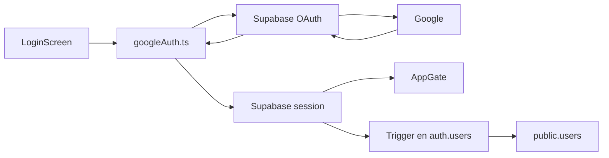

# Implementación del inicio de sesión con Google

Este documento explica cómo funciona el inicio de sesión con Google en la app, qué se implementó, cómo se configura y dónde está el código.

## Resumen

El login con Google se implementó usando OAuth de Supabase. La app abre el flujo de autenticación en un navegador seguro, Supabase devuelve un código de autorización y la app lo intercambia por una sesión válida. Cuando la sesión queda creada, el flujo de autenticación del proyecto actualiza la UI automáticamente.

## Cómo funciona

1. El usuario toca el botón de Google en la pantalla de login.
2. La pantalla llama al servicio de autenticación de Google.
3. El servicio pide a Supabase la URL de OAuth para Google.
4. La app abre esa URL en un navegador interno.
5. Google autentica al usuario y vuelve al redirect configurado por la app.
6. La app intercambia el resultado por una sesión Supabase.
7. `AppGate` detecta la sesión y deja pasar al resto de la app.
8. Si el usuario no tiene registro interno todavía, el trigger de Supabase crea el usuario en `public.users`.

## Qué se implementó

- Un servicio dedicado para iniciar y cerrar sesión con Google.
- Integración del botón de Google en la pantalla de login.
- Manejo de estados en la UI para carga y error.
- Configuración de Google OAuth en Supabase local.
- Un trigger de base de datos para crear el usuario interno al registrarse por primera vez.

## Dónde está la implementación

- [Pantalla de login](../src/features/auth/screens/LoginScreen.tsx)
- [Servicio de Google OAuth](../src/features/auth/services/googleAuth.ts)
- [Gate de autenticación](../src/features/auth/components/AppGate.tsx)
- [Configuración local de Supabase con Google](../supabase/config.toml)
- [Trigger para alta de usuario](../supabase/migrations/20260526005704_create_new_user_trigger.sql)

## Cómo se configura

Se necesita un archivo `.env` en la base del proyecto para cargar las variables locales.
El archivo `.env.local` anterior ya no se usa: elimínenlo de sus proyectos y pasen todos sus secretos al `.env` de la raíz.

### En la app

La app necesita las variables normales de Supabase para poder iniciar el flujo OAuth. Deben vivir en el archivo de entorno local del proyecto y nunca deben subirse al repositorio.

- `EXPO_PUBLIC_SUPABASE_URL`
- `EXPO_PUBLIC_SUPABASE_ANON_KEY`

### En Supabase local

Para habilitar Google OAuth en Supabase CLI, `supabase/config.toml` lee estas variables desde el entorno local:

- `GOOGLE_CLIENT_ID`
- `GOOGLE_CLIENT_SECRET`

Las credenciales de Google deben pedirse a Vladymir antes de configurar el entorno local.

Además, el proveedor de Google debe estar habilitado en Supabase y sus redirect URLs deben coincidir con las que usa la app.

## Cómo se usa

1. Arranca el proyecto con las variables de entorno locales listas.
2. Abre la app.
3. En la pantalla de login, toca **Continuar con Google**.
4. Completa la autenticación en el navegador.
5. Al volver a la app, la sesión queda activa y `AppGate` permite entrar al contenido.

## Flujo de datos

## Notas importantes

- No subir el archivo de entorno al repositorio.
- No compartir valores reales de variables en documentación ni en commits.
- El login con Google no usa Firebase para este flujo; el inicio de sesión se resuelve con Supabase.