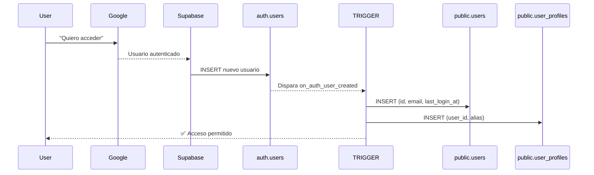
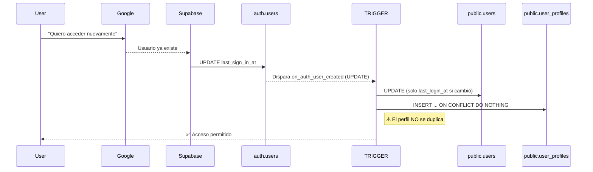

# Login Profile Creation - Reglas y Validación

## Resumen Ejecutivo

La aplicación Reciclame implementa un sistema de autenticación con Google OAuth a través de Supabase que **garantiza**:

1. ✅ **Primer login crea perfil**: El usuario recibe un registro en `public.users` y `public.user_profiles`
2. ✅ **Logins subsecuentes no duplican**: El sistema previene automáticamente duplicados usando constraints SQL
3. ✅ **Tracking de actividad**: Se registra `last_login_at` para monitorear la actividad del usuario
4. ✅ **Protección de datos**: No se sobrescriben datos existentes en logins subsecuentes

---

## Arquitectura

### Tablas Involucradas

```
auth.users (Supabase Auth)
    ↓ TRIGGER: on_auth_user_created
    ↓
public.users (Nuestro registro interno)
    ↓ FOREIGN KEY
    ↓
public.user_profiles (Datos del perfil del usuario)
```

#### Tabla: `public.users`

| Campo | Tipo | Constraints | Descripción |
| --- | --- | --- | --- |
| `id` | UUID | PRIMARY KEY | ID de usuario sincronizado con auth.users |
| `email` | TEXT | UNIQUE, NOT NULL | Email del usuario |
| `created_at` | TIMESTAMPTZ | DEFAULT now() | Timestamp de creación |
| `last_login_at` | TIMESTAMPTZ | - | Último login (actualizado por trigger) |

#### Tabla: `public.user_profiles`

| Campo | Tipo | Constraints | Descripción |
| --- | --- | --- | --- |
| `id` | UUID | PRIMARY KEY | ID único del perfil |
| `user_id` | UUID | UNIQUE, FK → users(id) | Relación 1:1 con usuario |
| `alias` | TEXT | - | Nombre mostrado (obtenido de metadata de Google) |
| `avatar_id` | UUID | FK → avatars(id) | Avatar del usuario (opcional) |
| `created_at` | TIMESTAMPTZ | DEFAULT now() | Timestamp de creación |
| `updated_at` | TIMESTAMPTZ | - | Último cambio |

### Trigger: `on_auth_user_created`

**Ubicación**: `supabase/migrations/20260528141600_trigger_handle_new_user.sql`

**Eventos que lo disparan**:
- `AFTER INSERT` en `auth.users` (primer login)
- `AFTER UPDATE` en `auth.users` (logins subsecuentes)

**Función**: `public.handle_new_user()`

---

## Comportamiento por Escenario

### Escenario 1: Primer Login (INSERT en auth.users)



**SQL Ejecutado**:

```sql
-- 1. Crear usuario interno
INSERT INTO public.users (id, email, last_login_at)
VALUES (auth_user_id, 'user@gmail.com', NOW())
-- Si existe el ID (no debería en primer login), lo ignora
ON CONFLICT (id) DO UPDATE SET last_login_at = NOW();

-- 2. Extraer nombre de metadata de Google
user_name := COALESCE(
  auth.raw_user_meta_data->>'full_name',
  auth.raw_user_meta_data->>'name',
  'nombre_por_defecto'
);

-- 3. Crear perfil
INSERT INTO public.user_profiles (user_id, alias)
VALUES (auth_user_id, user_name)
-- Si existe el perfil (no debería en primer login), lo ignora
ON CONFLICT (user_id) DO NOTHING;
```

**Resultado**:
- ✅ 1 registro en `public.users`
- ✅ 1 registro en `public.user_profiles`
- ✅ `last_login_at` = timestamp actual

---

### Escenario 2: Segundo Login (UPDATE en auth.users)



**SQL Ejecutado**:

```sql
-- 1. Actualizar usuario existente
INSERT INTO public.users (id, email, last_login_at)
VALUES (auth_user_id, 'user@gmail.com', NOW())
-- CLAVE: El ON CONFLICT DO UPDATE solo actualiza last_login_at
-- si el last_sign_in_at en auth.users cambió (detecta login real vs otras actualizaciones)
ON CONFLICT (id) DO UPDATE SET
  last_login_at = CASE
    WHEN new.last_sign_in_at IS DISTINCT FROM old.last_sign_in_at
      THEN NOW()
    ELSE public.users.last_login_at
  END;

-- 2. Intentar crear perfil nuevamente (pero está protegido)
INSERT INTO public.user_profiles (user_id, alias)
VALUES (auth_user_id, 'Nombre de usuario')
-- CLAVE: ON CONFLICT DO NOTHING previene duplicados
-- El perfil existente se mantiene sin cambios
ON CONFLICT (user_id) DO NOTHING;
```

**Resultado**:
- ✅ 1 registro en `public.users` (sin duplicados)
- ✅ 1 registro en `public.user_profiles` (sin duplicados)
- ✅ `last_login_at` = timestamp actual (actualizado)
- ✅ Datos del perfil = **sin cambios** (preservados)

---

### Escenario 3: Cambio de Email (UPDATE en auth.users)

**Situación**: Usuario edita su email en Supabase Auth, pero esto NO es un login.

**SQL Ejecutado**:

```sql
-- Validación en trigger
IF new.last_sign_in_at IS DISTINCT FROM old.last_sign_in_at THEN
  -- Es un login real: actualizar last_login_at
ELSE
  -- NO es un login (ej: cambio de email)
  -- Preservar last_login_at sin cambios
END;
```

**Resultado**:
- ✅ `public.users.last_login_at` = **sin cambios**
- ✅ `public.user_profiles` = **sin cambios**
- ℹ️ El email se sincroniza si es necesario

---

## Mecanismos de Protección

### 1. PRIMARY KEY en `id` (Tabla users)

```sql
id uuid PRIMARY KEY
```

- Previene más de un registro por usuario
- Sincronizado con `auth.users.id`

### 2. UNIQUE en `user_id` (Tabla user_profiles)

```sql
CREATE UNIQUE INDEX user_profiles_user_id_key ON public.user_profiles(user_id);
```

- Previene más de un perfil por usuario
- Asegura relación 1:1

### 3. ON CONFLICT (id) DO UPDATE (Inserción en users)

```sql
INSERT INTO public.users (id, email, last_login_at) VALUES (...)
ON CONFLICT (id) DO UPDATE SET
  last_login_at = CASE WHEN ... THEN NOW() ELSE ... END;
```

- No lanza error si el usuario ya existe
- Actualiza `last_login_at` condicionalmente

### 4. ON CONFLICT (user_id) DO NOTHING (Inserción en user_profiles)

```sql
INSERT INTO public.user_profiles (user_id, alias) VALUES (...)
ON CONFLICT (user_id) DO NOTHING;
```

- No lanza error si el perfil ya existe
- No modifica el perfil existente (preserva sus datos)

### 5. FOREIGN KEY CASCADE (Integridad referencial)

```sql
ALTER TABLE public.user_profiles
  ADD CONSTRAINT fk_user_profiles_user_id
  FOREIGN KEY (user_id) REFERENCES public.users(id)
  ON DELETE CASCADE;
```

- Si un usuario se elimina, su perfil también se elimina
- Mantiene consistencia de datos

---

## Flujo de Autenticación Completo

```
┌─────────────────────────────────────────────────────────────┐
│                    Usuario intenta login                     │
└────────────────────────┬────────────────────────────────────┘
                        │
                        ▼
            ┌──────────────────────┐
            │   LoginScreen        │
            │  (src/features/      │
            │   auth/screens)      │
            └────────┬─────────────┘
                    │
                    ▼
        ┌───────────────────────────┐
        │  googleAuth.signInWithGoogle()
        │  (src/features/auth/      │
        │   services/googleAuth.ts) │
        └────────┬──────────────────┘
                │
                ▼
    ┌─────────────────────────────┐
    │ Supabase OAuth.signInWithOAuth()
    └────────┬────────────────────┘
            │
            ▼
    ┌──────────────────────┐
    │  Google Auth Portal  │
    └────────┬─────────────┘
            │
            ▼
┌─────────────────────────────────┐
│ exchangeCodeForSession()         │
│ (Supabase crea auth.users)      │
└────────┬────────────────────────┘
        │
        ▼
┌──────────────────────────────┐
│  TRIGGER on_auth_user_created
│  (Automático)                │
└────────┬─────────────────────┘
        │
        ├─ INSERT/UPDATE public.users
        │   ON CONFLICT (id) DO UPDATE
        │
        └─ INSERT public.user_profiles
           ON CONFLICT (user_id) DO NOTHING
        │
        ▼
    ┌────────────────────┐
    │  AppGate           │
    │  (detecta sesión)  │
    └────────┬───────────┘
            │
            ▼
    ┌──────────────────────┐
    │  ✅ Usuario accede   │
    │     a la app         │
    └──────────────────────┘
```

---

## Validación y Pruebas

### Pruebas Incluidas

**Archivo**: `tests/auth/loginProfileCreation.test.ts`

```bash
npm test -- loginProfileCreation.test.ts
```

#### Test 1: Crear perfil en primer login

```
Debería crear un perfil de usuario en el primer login
✓ Verifica que user_exists = true
✓ Verifica que profile_exists = true
✓ Verifica que last_login_filled = true
```

**Función RPC**: `test_handle_new_user_on_insert()`

#### Test 2: Sin duplicación en logins subsecuentes

```
Debería NO duplicar datos de usuario en logins subsecuentes
✓ first_login_created_user = true
✓ first_login_created_profile = true
✓ second_login_users_count = 1
✓ second_login_profiles_count = 1
✓ no_duplication = true
```

**Función RPC**: `test_no_duplicate_on_subsequent_login()`

#### Test 3: Actualizar last_login_at

```
Debería actualizar last_login_at en logins subsecuentes
✓ Verifica que last_login_updated = true
```

**Función RPC**: `test_handle_new_user_on_login()`

#### Test 4: Preservar datos en updates no-login

```
Debería preservar last_login_at al editar otros campos
✓ Verifica que last_login_unchanged = true
```

**Función RPC**: `test_handle_new_user_on_non_login_update()`

### Ejecutar Pruebas

```bash
# Iniciar Supabase
npm run db:start

# En otra terminal, ejecutar pruebas
npm test -- loginProfileCreation.test.ts

# Ver salida detallada
npm test -- loginProfileCreation.test.ts --verbose
```

### Verificación Manual

Puedes verificar el estado manualmente en Supabase Studio:

1. Abre http://127.0.0.1:54323
2. Ve a **Table Editor**
3. Verifica:
   - `auth.users` tiene el usuario
   - `public.users` tiene exactamente 1 registro
   - `public.user_profiles` tiene exactamente 1 registro
   - `last_login_at` se actualiza en logins

---

## Diagrama de Decisión en el Trigger

```
┌─────────────────────────────────────────┐
│  Evento en auth.users                   │
├─────────────────────────────────────────┤
│  ¿Es INSERT o UPDATE?                   │
└────┬──────────────────────────────────────┘
     │
     ├─ INSERT (Primer login)
     │  ├─ INSERT INTO public.users
     │  │  ON CONFLICT DO UPDATE
     │  │  (crea nuevo o actualiza)
     │  │
     │  └─ INSERT INTO public.user_profiles
     │     ON CONFLICT DO NOTHING
     │     (crea nuevo o ignora)
     │
     └─ UPDATE (Login subsecuente u otro cambio)
        ├─ ¿Cambió last_sign_in_at?
        │  ├─ SÍ (Es un login real)
        │  │  ├─ UPDATE public.users.last_login_at = NOW()
        │  │  │
        │  │  └─ INSERT INTO public.user_profiles
        │  │     ON CONFLICT DO NOTHING
        │  │     (no hace nada - ya existe)
        │  │
        │  └─ NO (Email, phone, etc.)
        │     ├─ UPDATE public.users.last_login_at = MANTENER
        │     │
        │     └─ INSERT INTO public.user_profiles
        │        ON CONFLICT DO NOTHING
        │        (no hace nada - ya existe)
```

---

## Preguntas Frecuentes

### ¿Qué pasa si el usuario intenta crear un segundo perfil manualmente?

**Resultado**: Se rechaza silenciosamente por `ON CONFLICT (user_id) DO NOTHING`

```sql
INSERT INTO public.user_profiles (user_id, alias) VALUES (...)
-- Falla silenciosamente: el perfil existente no se sobrescribe
```

### ¿Se pierde el nombre del perfil si el usuario intenta re-logearse?

**Resultado**: NO. El `ON CONFLICT DO NOTHING` preserva el perfil existente.

```
Login 1: Perfil creado con alias = "Juan Pérez"
Login 2: Intent INSERT → ON CONFLICT DO NOTHING → Perfil mantiene alias = "Juan Pérez" ✓
```

### ¿Cómo se sincroniza el email?

El email se sincroniza automáticamente porque el `id` es el mismo en ambas tablas:

```
auth.users.id = public.users.id
```

Si el usuario cambia email en Supabase Auth, el trigger lo actualiza en `public.users.email`.

### ¿Qué pasa si hay un error en el trigger?

Si el trigger falla:
- La sesión de Supabase Auth se crea igual
- El usuario puede entrar (Supabase Auth funciona independientemente)
- Pero los datos en `public.users` y `public.user_profiles` no se crean
- La app detectará que falta el perfil y puede mostrar un error o crear uno en ese momento

### ¿Cómo se elimina un usuario?

Si usas `DELETE FROM auth.users`:

```sql
DELETE FROM auth.users WHERE id = 'xxx'
```

El trigger NO se dispara en DELETE. Tendrías que eliminar manualmente:

```sql
DELETE FROM public.user_profiles WHERE user_id = 'xxx';
DELETE FROM public.users WHERE id = 'xxx';
```

O mejor, usa Supabase Admin para borrar usuarios.

---

## Referencias

- **Migración del Trigger**: `supabase/migrations/20260528141600_trigger_handle_new_user.sql`
- **Funciones de Test**: `supabase/migrations/20260528150200_trigger_rpc_handle_new_user.sql`
- **Pruebas Jest**: `tests/auth/loginProfileCreation.test.ts`
- **Documentación de Login**: `docs/IMPLEMENTACION_LOGIN_GOOGLE.md`
- **Schema**: `supabase/migrations/20260522000001_create_tables.sql`

---

## Checklist de Validación

- [x] El trigger previene duplicación de usuarios
- [x] El trigger previene duplicación de perfiles
- [x] El `last_login_at` se actualiza correctamente
- [x] El `last_login_at` se preserva en updates no-login
- [x] El nombre del usuario se extrae de metadata de Google
- [x] Las pruebas pasan exitosamente
- [x] La integridad referencial se mantiene
- [x] Sin errores de conflicto en logins subsecuentes

---

**Versión**: 1.0  
**Última actualización**: 2026-05-31  
**Responsable**: Copilot
