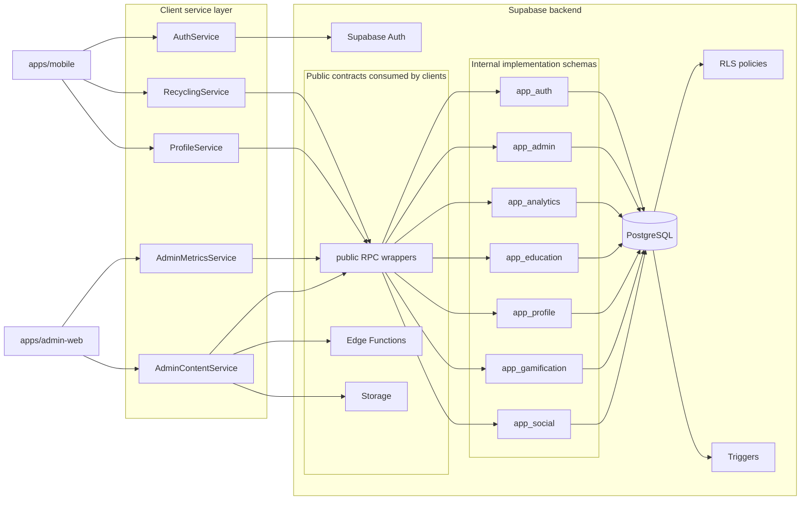

# Backend Logical Model

This is the operational mental model for developers.

## Rule

- clients call `public.*` RPC names or Edge Functions
- implementation moves into domain schemas
- triggers and policies must point to the owning domain when possible
- new migrations should preserve public compatibility unless a breaking change is deliberate

## Migration map

| Domain schema | Purpose | Introduced by |
| --- | --- | --- |
| `app_auth` | account lookup, auth trigger implementation | `20260613010000_domain_function_schemas.sql`, `20260613020000_expand_domain_function_schemas.sql` |
| `app_admin` | admin authorization helpers | `20260613020000_expand_domain_function_schemas.sql` |
| `app_analytics` | dashboard/reporting implementations | `20260613010000_domain_function_schemas.sql` |
| `app_education` | educational content implementations | `20260613010000_domain_function_schemas.sql` |
| `app_profile` | avatar/profile mutation implementations | `20260613020000_expand_domain_function_schemas.sql` |
| `app_gamification` | medals/progression mutation implementations | `20260613020000_expand_domain_function_schemas.sql` |
| `app_social` | friends/social aggregate implementations | `20260613010000_domain_function_schemas.sql` |